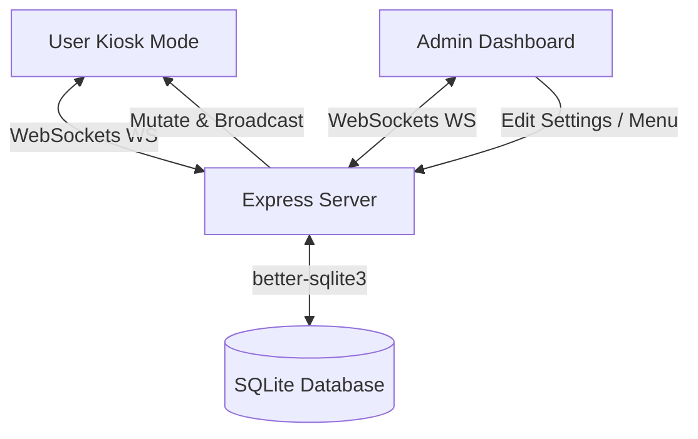
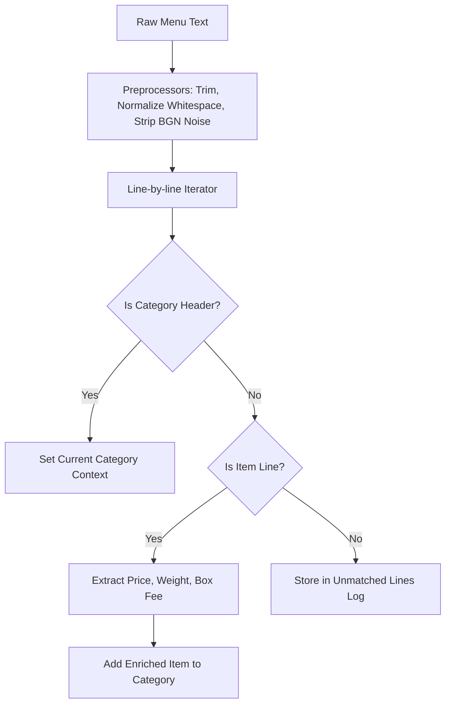

# 🍱 LunchPad Logic & Features Documentation

LunchPad is an enterprise-grade, high-fidelity self-service canteen management system. It combines a real-time responsive ordering kiosk, an administrative dashboard, a database-driven menu parser with AI synthesis capabilities, and an active RFID balance transaction engine. 

This document provides a highly detailed review of the LunchPad codebase, detailing the system architecture, database schema, parsing flows, checkout transactions, and AI-enabled capabilities.

---

## 🏗️ 1. Core Architecture & Real-Time State Sync

LunchPad employs a **State Broadcast on Mutation** architectural pattern. High responsiveness is achieved by avoiding polling in favor of native full-duplex WebSockets.

### ⚡ Technical Details
* **Frontend State**: Controlled via a sliced **Zustand** store (`src/store/useStore.ts`) separating concerns into `authSlice`, `menuSlice`, `orderSlice`, `settingsSlice`, `analyticsSlice`, and `uiSlice`.
* **Real-time Sync**: The native WebSocket server (`server/broadcast.ts`) maintains active client handles. When mutations occur (such as updating menus, updating cards, toggling kiosk status, or placing orders), the server broadcasts specific actions (`MENU_UPDATE`, `NEW_ORDER`, `STATUS_UPDATE`, `INITIAL_STATE`) to synchronize all screens instantly.
* **Server Stack**: Driven by Node.js, Express, `better-sqlite3` for local low-latency storage, and `tsx` for high-performance TypeScript compilation in dev environments.

---

## 📊 2. Database Schema & Index Architecture

The database is built on a highly optimized SQLite database managed through `better-sqlite3` transactions, detailed in `server/db.ts`.

### 🗄️ Relational Tables
| Table | Primary Key | Description | Key Fields |
| :--- | :--- | :--- | :--- |
| `cards` | `rfid` (TEXT) | Tracks canteen user accounts, RFID tokens, PINs, and balances. | `ownerName`, `balance` (REAL), `isAdmin` (INT), `pin` (TEXT) |
| `menu` | `id` (INTEGER) | Houses daily menu items, categories, and custom pricing logic. | `name`, `price` (REAL), `category`, `available` (INT), `requiresSideChoice`, `sideChoices` (JSON) |
| `orders` | `id` (TEXT) | Immutable log of orders placed by users. | `rfid`, `items` (JSON), `totalPrice` (REAL), `timestamp` (ISO), `status` |
| `daily_summaries` | `date` (TEXT) | Pre-aggregated sales metrics for fast analytics dashboard queries. | `totalSales` (REAL), `orderCount` (INT), `feeDistributed` (INT) |
| `settings` | `key` (TEXT) | Global key-value pair settings. | `value` (TEXT) |
| `parser_profiles` | `id` (TEXT) | Parser presets defining preprocessing and parsing options. | `name`, `status`, `isActive` (INT) |
| `parser_versions` | `id` (TEXT) | Version control for parser profile configurations. | `profileId`, `versionNumber` (INT), `configJson` (JSON) |
| `parser_fixtures` | `id` (TEXT) | Golden tests to validate parser accuracy during changes. | `name`, `rawInput`, `expectedOutputJson` |
| `parser_logs` | `id` (TEXT) | Tracks unmatched lines and failed extractions for menu parsing. | `timestamp`, `rawInput`, `unmatchedLines` (JSON) |

### ⚡ High-Performance Indexing
The database implements specific indexes to guarantee constant $O(1)$ lookup time for critical user flows:
* `idx_orders_timestamp` (Descending): Accelerates historical analysis and dashboard feeds.
* `idx_cards_lower_rfid` (Lowercased RFID): Enables instant, case-insensitive lookups for RFID swipes.
* `idx_cards_pin`: Optimizes checkout searches when PIN authorization is used.
* `idx_orders_lower_rfid_timestamp`: Optimizes retrieval of custom order history for specific cardholders.

> [!NOTE]
> Database setup automatically runs an in-line migration engine executing sequential table updates (e.g. adding columns like `pin`, `requiresSideChoice`, `sideChoices`, `hasIncludedSide`, `tags`, and `packagingFee`) to ensure smooth forward compatibility.

---

## 🏷️ 3. Menu Parsing Engines

LunchPad features a sophisticated dual parsing architecture capable of translating chaotic, raw kitchen-formatted text into structured, available menu items.

### A. The Regex Parser (`src/utils/advancedMenuParser.ts`)
Uses complex, tuned regular expressions to parse text.
* **Date Extraction**: Supports direct date extraction (`15.10.2025`) and relative weekly range parsing (`03 - 07.11.2025`). It resolves relative weekday strings (e.g., `ПОНЕДЕЛНИК` or `MONDAY`) to exact date timestamps based on the week's reference Monday.
* **Weight Capture**: Matches standard weight and volume units (`гр`, `g`, `ml`, `мл`).
* **Price Isolation**: Multi-format regex recognizing European and Bulgarian notations (e.g. `1.80€`, `2.50 лв`, or trailing dash shorthand `— 3.00`).
* **Box Fee Isolation**: Identifies container keywords (`кутийка`) and captures dedicated pricing.
* **Category Auto-Boxing**: Maps raw category names into standard English and Bulgarian sections using the `CategoryMapping` dictionary.

### B. The DB-Driven Parser Engine (`src/utils/parserEngine.ts`)
An abstract, configurable implementation of the parsing process. It allows the admin to write custom regex patterns and rule pipelines directly in the Dashboard:
* **Preprocessing Rules**: Dynamic execution pipelines (e.g. `trim`, `normalize_whitespace`, `remove_pattern`) defined as JSON configurations.
* **Section Detectors**: Customizable patterns that identify headers and assign custom configurations (such as standard packaging fees).
* **Enrichment Rules**: Applies actions on matched entities (e.g., adding `autobox` tags to `Salads` or `BBQ` categories so a container fee is pre-applied during checkout).

---

## 💳 4. Order Validation & Financial Transactions Engine

The transactional core (`server/services/orderService.ts`) handles financial integrity with strict mathematical precision and structural validation.

### 💵 Fee Calculations
The total cost of an item is calculated as:
$$\text{Total Price} = \text{Base Price} + \text{Packaging Fee}$$

* **Tag-Aware Packaging Fee Rules**: 
  - If the item has a custom `packagingFee` specified in the database, it uses it.
  - If the item is tagged as `autobox` or falls into special categories (`Side Dishes`, `Salads`, `BBQ`, `Гарнитури`, `Скара`), it automatically adds the global `settings.packagingFee` (defaulting to `0.10` if not set).
  - Otherwise, no box fee is applied.

### 🛡️ Transaction Integrity Safeguards
When a user clicks "Place Order", the backend performs the following validations:
1. **Menu Version Lock**: Checks if the client's menu version matches `settings.menuVersion`. If the admin updated the menu in the background, checkout is blocked with a `409 Conflict` error to prevent users from ordering outdated items.
2. **Kiosk Status Check**: Validates that Kiosk ordering is open.
3. **Identity Verification**: Authorizes via a swiped case-insensitive RFID code or a secure 6-digit PIN.
4. **Side-Dish Validation**: If an item is flagged with `requiresSideChoice` or `hasIncludedSide`, the system validates that the selected side is valid and included in the menu item's permitted choices.
5. **Atomic Commit**: Updates the database inside a strict SQL transaction:
   - Increments the user's card debt: `balance = balance + total_order_price`
   - Records the order details including items, options, and timestamps.
   - Updates `daily_summaries` for fast analytical tracking.

---

## 🤖 5. AI Rules Synthesis & OCR Vision capabilities

LunchPad integrates advanced Large Language Model endpoints (`server/controllers/aiController.ts`) to enable intelligent canteen administration.

* **Unified Provider Integration**: Seamlessly maps standard AI interfaces across **OpenAI**, **Gemini**, and **Anthropic** utilizing developer keys specified in server settings.
* **OCR Vision Analysis**: Accepts base64 menu images (e.g., cell phone photos of printed kitchen lists) and transcribes them into clean, standardized markdown tables grouped by day, resolving Cyrillic text and handwriting.
* **AI Rule Synthesis**: Analyzes raw menu texts alongside existing configurations and output schemas to automatically suggest optimized regular expressions and category matching rules.

---

## 🔒 6. Security, Networking, & Localization

* **Access Control Whitelist**: Supports toggling strict network filtering. When enabled, only client IPs matching a specific admin IP whitelist can make state mutations or place orders.
* **Kiosk Timing Automation**: Offers automated kiosk operations. Canteen managers can configure "Open At", "Close At", and "Close Day" values to automate canteen open schedules without manual oversight.
* **Two-Way Localization**: Fully localized in English (`en`) and Bulgarian (`bg`) via standard dictionary files (`src/translations.ts`) and dynamically registered database translations (`custom_languages`).
