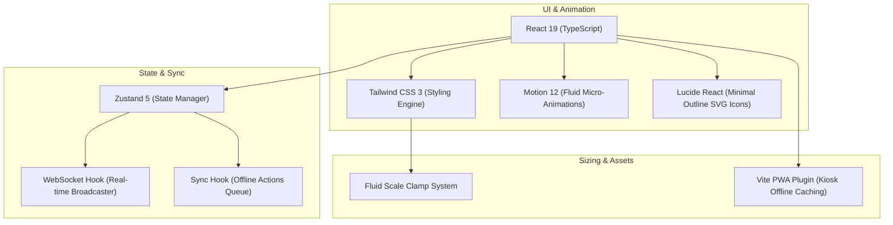
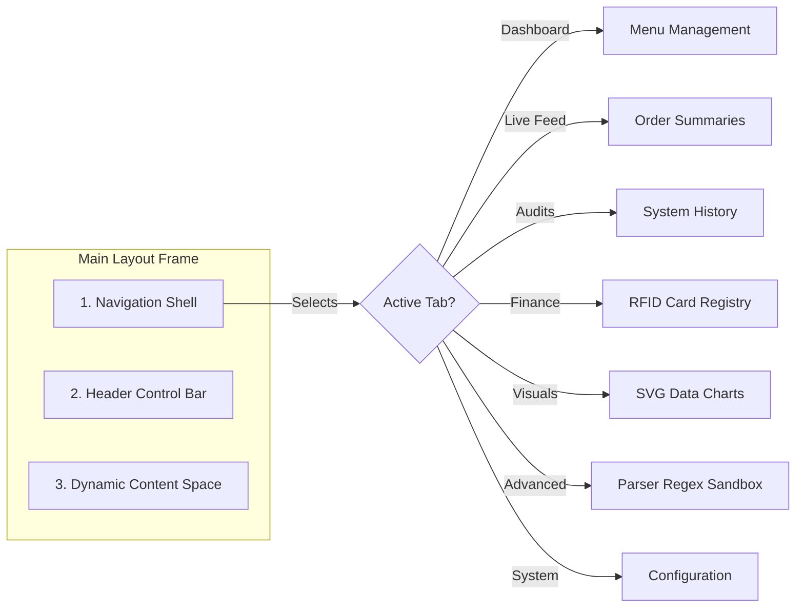

# 🎨 LunchPad UI Design System & Tech Stack Reference

This document is the official **single source of truth** for the visual identity, design guidelines, interaction mechanics, and technical frontend stack of the **LunchPad Canteen Management System**. 

Use this file as an absolute blueprint for developers and designers to ensure that all future iterations, feature implementations, and system expansions strictly adhere to the premium, responsive, and tactile standards established in the codebase.

---

## 🛠️ 1. Technical Frontend Stack

LunchPad is architected as a modern, client-centric Single Page Application (SPA) optimized for physical canteen kiosks, administrative screens, and personal mobile devices.



### Core Technologies
*   **React 19 (TypeScript)**: Utilizes the latest React features, component memoization (`React.memo`), strict type-safety, and concurrent rendering hooks.
*   **Vite 6**: Powering sub-second Hot Module Replacement (HMR) and compiling highly-optimized production chunks.
*   **Zustand 5 (`src/store/useStore.ts`)**: Decentralized, selector-driven state management sliced into modular business domains. Allows lightning-fast state reactivity without unnecessary rerenders.
*   **Tailwind CSS 3 + Modern Custom CSS (`src/index.css`)**: Combines Tailwind's fast-prototyping utility model with handcrafted CSS custom property scaling tokens and advanced CSS filters.
*   **Motion 12 (`motion/react`)**: Animates slide-in drawers, spring-loaded active pills, checkout success overlays, and dialogs.
*   **Lucide React**: Vector outline iconography keeping interactive elements lightweight and highly recognizable.
*   **Recharts 3 (`src/components/manager/tabs/AnalyticsTab.tsx`)**: Renders highly performant, responsive SVG-based data visualizations for manager-facing dashboards.

---

## 📐 2. Visual Identity & Design Tokens (`src/index.css`)

LunchPad adopts a **contemporary-neutral** palette overlaid with a subtle **glassmorphism** hierarchy, high-contrast violet accents, and fluid scale properties.

### 🎨 Color System & Palette

| Token / Layer | Tailwind Mapping | Value / Code | Visual Usage |
| :--- | :--- | :--- | :--- |
| **App Canvas Background** | `bg-zinc-100` / `#F4F4F5` | `#F4F4F5` | Base desktop frame background. High contrast for cards. |
| **Card Backings** | `bg-white` | `#FFFFFF` | Core content containment. Soft borders to prevent visual noise. |
| **Primary Violet Gradient** | `premium-gradient-violet` | `from-violet-600 to-indigo-700` | CTA buttons, active accents, brand markers. |
| **Primary Neutral Gradient** | `premium-gradient-neutral` | `from-neutral-900 to-neutral-700` | Headers, manager navigation bars, bold actions. |
| **Border Highlights** | `border-white/40` | `rgba(255,255,255,0.4)` | Glass borders providing high-end depth and isolation. |
| **Overlay Backdrops** | `bg-black/40` | `rgba(0,0,0,0.4)` | Blurs standard viewports to center active modal focus. |

### 🔍 Styling Utilities & Glassmorphism

Handcrafted utility classes defined in `src/index.css` enforce structural design consistency:

```css
/* Sleek responsive translucent background */
.glass-morphism {
  background: rgba(255, 255, 255, 0.7);
  backdrop-filter: blur(20px);
  border: 1px solid rgba(255, 255, 255, 0.4);
}

/* Translucent dark theme for selected dark segments */
.glass-morphism-dark {
  background: rgba(23, 23, 23, 0.8);
  backdrop-filter: blur(20px);
  border: 1px solid rgba(255, 255, 255, 0.1);
}

/* Depth shadow system layering multiple soft light vectors */
.premium-shadow {
  box-shadow: 
    0 10px 15px -3px rgba(0, 0, 0, 0.04),
    0 4px 6px -2px rgba(0, 0, 0, 0.01),
    0 20px 25px -5px rgba(0, 0, 0, 0.03);
}

/* Micro-interaction lift */
.hover-lift {
  transition: transform 150ms cubic-bezier(0.4, 0, 0.2, 1);
}
.hover-lift:hover {
  transform: translateY(-4px);
}
.hover-lift:active {
  transform: scale(0.98);
}
```

### 🔤 Fluid Sizing & Typography

Typography scales organically across viewports (mobile phones to wall-mounted kiosks) using CSS `clamp()` and responsive variables:

*   **Dynamic Scale Variable**:
    *   `--scale-factor: 1` (Mobile Viewports)
    *   `--scale-factor: 1.05` (Tablets / Small screens: `min-width: 768px`)
    *   `--scale-factor: 1.1` (Desktop / Large screens: `min-width: 1024px`)
*   **Fluid Font Classes**:
    *   `--fluid-base` / `font-size`: `clamp(14px, 2vw, 16px)`
    *   `--fluid-lg` / `Large Titles`: `clamp(16px, 2.5vw, 18px)`
    *   `--fluid-xl` / `Header Titles`: `clamp(18px, 3vw, 24px)`
    *   `--fluid-2xl` / `Display / Pin-pad`: `clamp(24px, 4vw, 32px)`

---

## 📱 3. Responsive Core Kiosk UI & Layout Patterns

The Kiosk mode operates as a **Fixed Viewport App** (`fixed-viewport`), locking layout bounds to `100vh` and `100vw`. This removes double-scroll bars and disables default browser rubber-banding/pull-to-refresh overscrolls to establish a true native-application experience.

```
+--------------------------------------------------------------------------------+
|  [LUNCHPAD LOGO]             [SYSTEM CLOCK (12:45)]           [BG | EN]        |
+-------------------+------------------------------------------+-----------------+
|  1. SIDEBAR       |  2. MENU GRID (Scrolls Internally)       |  3. ORDER PANE  |
|                   |                                          |                 |
|  * Soups          |  +--------------------+----------------+  |  Cart Items:    |
|  * Salads         |  | Tarator (Soup)     | Meatball (BBQ) |  | * Soup    x1    |
|  * BBQ            |  | €2.40  [Add to C.] | €4.50  [Add]   |  | * Salad   x2    |
|  * Desserts       |  +--------------------+----------------+  |                 |
|                   |  | Rice (Side)        | Cream (Dess.)  |  | Total: €11.40   |
|  [RFID Wave]      |  | €1.80  [Add to C.] | €2.00  [Add]   |  |                 |
|                   |  +--------------------+----------------+  | [PLEASE SCAN]   |
+-------------------+------------------------------------------+-----------------+
```

### 1. Left Sidebar Navigation (`KioskCategorySidebar.tsx`)
*   **Active Tab Transition**: Highlights categories with a unified active pill background that slides vertically between items via Framer Motion's `layoutId="active-cat-pill"` utilizing a `circOut` tween transition.
*   **Category Logic**: Automatically pushes items containing the term "Other" or "Други" to the bottom of the list.
*   **Packaging Indicators**: Pulls category settings to label tabs with miniature `"Box"` pill-tags if the selected category is configured to trigger automated packaging fees.

### 2. Center Menu Grid (`KioskItemList.tsx`)
*   **Responsive Breakpoints**: Auto-wrapping responsive grid that switches from `grid-cols-1` on mobile to `grid-cols-2` or `grid-cols-3` on desktop.
*   **Garnish / Side Selection**: Clicking an item requiring selection reveals a nested slide-out select drawer right inside the card viewport. This drawer expands and collapses smoothly using physical spring animations (`motion.div` height dynamics).
*   **Auto-Box Alert Badge**: Beautiful inline tags warn the customer if their selection automatically bundles a container container fee.

### 3. Right Order Details Panel (`KioskOrderPanel.tsx`)
*   **Breakpoint Behavior**:
    *   **Desktop/Tablet**: Rigid right-hand side panel containing order totals, itemized packaging calculations, and real-time RFID status instructions.
    *   **Mobile Phone (`isPhone`)**: Collapses the right panel into a **swipeable sticky bottom sheet** (`drag="y"`, `dragConstraints={{ top: 0, bottom: 0 }}`). Tapping the cart totals trigger a spring-loaded vertical expansion to `80vh` for full viewport checkout interaction.
*   **Visual Highlights**: A sliding shimmer animation (`.shimmer`) cycles across the primary scan CTA button to invite customers to hold up their tags when no card is scanned.

---

## 🏢 4. Administrative Dashboard Layout

The Manager Dashboard is a tabbed workspace built for operational oversight and deep canteen configurations.



### Key Administrative Interfaces:
1.  **System Controller Header (`ManagerDashboard.tsx`)**: Houses a live kiosk toggle (`kioskOpen`). Toggling this immediately broadcasts a WebSocket command that locks or unlocks public access code kiosks in real-time.
2.  **Advanced Rules Sandbox (`ParserRulesTab.tsx`)**: A complex IDE-grade component (91KB) that empowers admins to craft, modify, and test regular expressions against raw unstructured daily text menus. Shows extraction previews, section boundaries, and cost normalizations.
3.  **Analytics Canvas (`AnalyticsTab.tsx`)**: Integrates **Recharts** to project interactive line charts (sales timelines), bar charts (container packaging allocations), and area charts (hourly customer flows).
4.  **Security Pin-Pad Overlay (`PinPadModal.tsx`)**: Prompts staff with a customized high-contrast fullscreen numeric key matrix featuring instant haptic feedback to prevent accidental key skips.

---

## 💎 5. Touch UX & Micro-Interactions

A key aspect of LunchPad's premium visual quality is how alive and tactile it feels when touched or clicked.

### 📳 Tactical Physical Feedback (`src/utils/haptics.ts`)
Taps and status changes fire custom physical feedback on mobile/tablet browsers using the HTML5 Vibration API (`navigator.vibrate`):
*   **Light (`10ms`)**: Standard button selections and quantity increment changes.
*   **Medium (`20ms`)**: Collapsing/expanding the mobile cart sheet or opening details.
*   **Heavy (`50ms`)**: Activating the security Pin-Pad or clearing a active cart.
*   **Success (`[10, 50, 30]ms`)**: A physical double-tap feel confirming an order dispatch.
*   **Error (`[30, 40, 30, 40, 50]ms`)**: A rapid juddering pattern alerting a card lookup failure.

### 🔑 Hardware Integration (`useRfidScanner.ts`)
Since standard RFID readers simulate swift human keyboard keystrokes, a global document listener intercepts character buffers in the background:
*   Automatically ignores inputs if standard focus is held inside traditional `<input>`, `<textarea>`, or content-editable elements to prevent keystroke capture conflicts.
*   Enforces an activity limit (clears buffers if no `Enter` key is fired within `2000ms`).
*   Cleans and processes card IDs before broadcasting updates back to state.

### 📐 Ergonomic Touch Expansion
All interactive icons or elements smaller than the accessibility standard `44px` utilize the `.touch-target-expansion` class:
```css
.touch-target-expansion {
  position: relative;
}
/* Creates an invisible 10px tap expansion ring on all sides */
.touch-target-expansion::after {
  content: '';
  position: absolute;
  top: -10px;
  bottom: -10px;
  left: -10px;
  right: -10px;
  z-index: 10;
}
```

---

## 📦 6. State Architecture & Offline Capabilities

LunchPad runs on a unified, high-speed Zustand store divided into 6 modular slices, guaranteeing optimal state separation:

```
                  +-----------------------------------+
                  |           useStore.ts             |
                  +-----------------------------------+
                                    |
     +-----------------+------------+------------+-----------------+
     |                 |            |            |                 |
+---------+       +---------+  +---------+  +----------+      +---------+
|  auth   |       |  menu   |  |  order  |  | settings |      |   ui    |
|  Slice  |       |  Slice  |  |  Slice  |  |  Slice   |      |  Slice  |
+---------+       +---------+  +---------+  +----------+      +---------+
```

### Zustand Slices
1.  **`authSlice`**: Tracks administrative authorization tokens, login attempts, and operational levels.
2.  **`menuSlice`**: Holds currently normalized daily offerings, available garnish items, and menu status indices.
3.  **`orderSlice`**: Drives shopping cart modifications, quantity shifts, selected side garnishes, and pricing calculations.
4.  **`settingsSlice`**: Configures tax allocations, base container fees, allowed auto-box lists, and dual-currency toggles.
5.  **`analyticsSlice`**: Controls live transaction timelines, sales volume records, and database logs.
6.  **`uiSlice`**: Manages temporary modal visibilities, pin-pad prompts, and layout categories.

### Offline Resiliency & Real-time Sync
*   **State Sync (`useSyncState.ts`)**: Watches state changes. Actions performed offline are stored in a prioritized queue. When internet connectivity is restored, items are cleanly batch-submitted.
*   **WebSocket Hook (`useWebSocket.ts`)**: Emits high-speed messages for operations requiring multi-screen synch, such as immediate kiosk lockouts and active card updates.

---

## 📝 7. UI Development Rules (Golden Guidelines)

To maintain the high aesthetic quality, accessibility standards, and system stability, any developer modifying this repository must adhere strictly to these rules:

1.  **Do Not Inject Inline Custom Hex Codes**:
    *   *Incorrect*: `className="bg-[#2a13bd] text-[#f2f2fa]"`
    *   *Correct*: Use Tailwind properties or declare custom properties within `src/index.css`.
2.  **Maintain Fixed Viewport Strictness**:
    *   Never allow root viewport overflow. Wrap dynamic panels using `overflow-y-auto custom-scrollbar` or `no-scrollbar` classes to isolate internal grid layouts.
3.  **Ensure Tactile Feedback on Interactive Deltas**:
    *   Every incremental cart action, success completion, and input error must fire the safe `triggerHaptic` utility.
4.  **Use Spring Animations for Structural Modals**:
    *   Prefer Framer Motion springs (`type: "spring", damping: 30, stiffness: 450`) over standard linear CSS transitions for all drawer slides, popovers, and collapsible blocks.
5.  **Maintain Tap Targets Above 44px**:
    *   Use Tailwind padding or the `.touch-target-expansion` utility to ensure that touch targets are comfortable on hand-held tablet devices.
